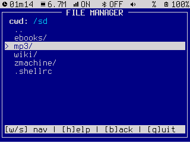
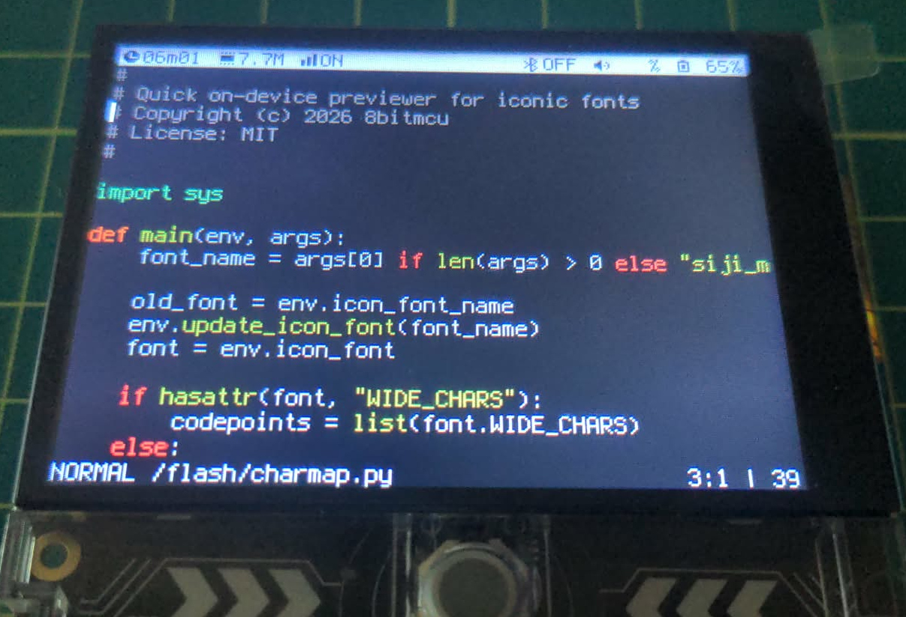

# vtOS: A terminal-based hobby firmware

vtOS turns a LilyGO T-Deck into a pocket-sized, hackable terminal computer. Written in MicroPython, it boots into a built-in shell stocked with retro and modern network clients (SSH, FTP, Telnet, IRC, email, Gemini, Gopher), a TUI file manager and `vi` based editor, offline Wikipedia and e-book readers, LoRa and BLE flood-mesh chat, and a few games for good measure; while also doubling as a server you can SSH, FTP, or VNC into from another machine. Automate it with a `.shellrc`, and since it's MicroPython all the way down, the whole system is open to read, tweak, and extend.


| application slideshow | vi app |
| :---: | :---: |
|  |  |


## 📟 T-Deck Hardware Integration

This project is optimized for the **LilyGO T-Deck**.

### 🛠 Supported Components

| Component | Specification | Driver / Status |
| :--- | :--- | :--- |
| **Memory** | 8MB PSRAM / 16MB Flash | ✅ Enabled for Large Buffer Handling |
| **Display** | SPI 2.4" ST7789 LCD (320x240) | ✅ Optimized SPI bus (Full Color) |
| **LoRa Radio** | SPI SX1262 | ✅ Own Configuration Utility |
| **Bluetooth** | BLE | ✅ Flood-mesh chat over BLE |
| **Keyboard** | I2C | ✅ Mapped Interface |
| **Trackball** | GPIO | ✅ Mapped Interface |
| **Speaker** | I2S | ✅ MP3/WAV Playback Support |
| **SD Card** | SPI | ✅ FAT formatted SD Card |
| **Microphone** | I2S, ES7210 ADC | ❌ Noise issues |
| **Touchscreen** | GT911 | N/A |


## ⚡ Quick Install (Pre-compiled Binaries)

You can download and flash the latest pre-compiled firmware directly to your T-Deck.

### Option A: Flash from the web

1. **Download the Firmware**: Go to the [Releases Page](https://github.com/8bitmcu/vtOS/releases) and download the latest *.bin asset.

2. **Flash to the T-Deck**: Use a web flashing tool like [https://web.esphome.io](https://web.esphome.io) to flash the binary

### Option B: Flash from command line

1. **Download the Firmware**: Go to the [Releases Page](https://github.com/8bitmcu/vtOS/releases) and download the latest *.bin asset.

2. **Flash to the T-Deck**: Make sure your T-Deck is plugged in via USB, then use esptool.py to write the firmware to the device. You may need to install esptool first (`pip install esptool`).

```Bash

esptool.py -p /dev/ttyACM0 -b 460800 --chip esp32s3 write_flash 0x0 firmware.bin

```

### Option C: Bootloader (Launcher)

This firmware is fully compatible with [Launcher](https://bmorcelli.github.io/Launcher), an on-device application launcher and bootloader for ESP32 devices. This method is perfect if you want to seamlessly swap between `vtOS` and other firmware on the go without needing a PC.

1. **Install Launcher**: Open a Web Serial compatible browser (like Chrome or Edge) and navigate to the Launcher website. Select Web Flasher and follow the prompts to install the bootloader directly to your T-Deck.
2. **Prepare your SD Card**: Download the latest *.bin from the Releases Page and copy it to a MicroSD card.
3. **Boot and Install**: Insert the MicroSD card into your T-Deck and power it on. Using the Launcher interface on the device's screen, navigate to your SD card and select the `vtOS` binary to flash it.


## 📝 How to use

### Trackball Usage
- **Short Press**: Sends `Esc`
- **Long Press**: Sends `KeyboardInterrupt`
- **Scroll up**: Scroll up st terminal history
- **Scroll down**: Scroll down st terminal history
- **Scroll left**: Scroll up st command history
- **Scroll right**: Scroll down st command history

### Available commands

You can execute the following commands from the built-in shell:

| Command | Description |
| :---   | :--- |
| `blechat` | A flood-mesh chatroom broadcast over Bluetooth LE advertising |
| `chess` | Basic chess game using unicode characters |
| `clear` | Clears the screen |
| `c2` | Codec 2 audio/voice codec encode/decode utility |
| `dict` | DICT protocol dictionary lookup client |
| `echo` | Prints its arguments back out |
| `epub` | EPUB e-book reader; open a `.epub` file and browse chapters via its table of contents |
| `fav` | Built-in shell aliases |
| `fc` | Font Configuration Utility. Try `menu fc` |
| `fm` | Starts the TUI File Manager |
| `ftp` | FTP Client that mounts it's content as a VFS |
| `ftpd` | Launches a FTP Server on `/` with user `admin` and pwd `admin`. Unencrypted. |
| `gemini` | Gemini protocol browser; connect to a `gemini://` url, or use `menu gemini` for saved sites |
| `gopher` | Gopher protocol browser; connect to a `gopher://` url, or use `menu gopher` for saved sites |
| `irc` | Connects to an IRC channel given a server, port, nickname and channel. Try `menu irc` |
| `loracfg` | Utility to configure LoRa frequency and power. Try `menu loracfg` |
| `lorachat` | A basic chatroom based on the LoRa radio |
| `md` | Markdown/plain text file viewer; open a `.md`, `.markdown` or `.txt` file |
| `menu` | An interactive shortcut menu for commands. |
| `mines` | Opens the minesweeper clone |
| `nm` | TUI Network Manager. Can also be used as a command line tool |
| `ping` | Used to test the reachability of a given host |
| `play` | Audio player that supports WAV, MP3 and C2 (Codec 2) encoded files. |
| `pop3` | POP3 email client; connect with `pop3 <host> <user> <password> [port]` |
| `rec` | Audio recorder that records to WAV or C2 (Codec 2). Note: Noise issues currently unresolved |
| `rss` | RSS Reader; connect to a RSS url to retreive the articles, or use `menu rss` for saved feeds |
| `sftp` | SFTP Client that mounts its content as a VFS |
| `sftpd` | SFTP Server; runs in the background |
| `smtp` | SMTP email client; compose in `vi` and send with `smtp <host> <user> <password> [port]` |
| `ssh` | SSH Client; connect to a remote ssh server |
| `sshd` | SSH Server; runs in the background, shares this device's shell. |
| `stream` | Streams internet radio (MP3 over HTTP); pass a URL, or use `menu stream` for saved stations |
| `telnet` | Connects to a telnet server. try `menu telnet` |
| `telnetd` | Telnet Server; runs in the background, shares this device's shell. Unencrypted. |
| `usbmsc` | Shares `/sd` with your PC as a USB Mass Storage drive over USB-C. |
| `vi` | Opens the vi port (based on [neatvi](https://github.com/aligrudi/neatvi)). Includes 5 configurable themes, check `.virc` |
| `vncd` | Launches a VNC Server. Known compatible with TigerVNC. Terribly slow |
| `webvncd` | Launches a web "VNC"-like server. Faster than `vncd` |
| `wiki` | Offline Simple English Wikipedia reader; ~170MB from SD. See `utils/wikiconvert.py` |
| `zm` | Launches `dfrotz`, the ZMachine interpreter |

To get out of the shell, type `exit`. This will bring you to the MicroPython shell, where you can type in python expressions. To get back to the built-in shell, type `sh` in the MicroPython shell.

### Startup script (`.shellrc`)

On launch, the shell runs commands from a `.shellrc` file, if one exists. It checks `/flash/.shellrc` first; if that doesn't exist, it falls back to `/sd/.shellrc` (only one of the two ever runs, never both). Each line is treated exactly like something you'd type at the shell prompt, including quoted arguments; blank lines and lines starting with `#` are ignored. Ending the file with `exit` skips the interactive prompt entirely and drops you straight into the MicroPython REPL after the rest of the file runs.

Example `/flash/.shellrc`:
```
# default font
fc terminus_mpy_12

# connect to wifi
nm connect MyNetwork "my wifi password"

# launches the interactive menu
menu
```

### Still not sure where to start?

Follow the on-device tutorial by launching `menu md` or skip to the interactive menu by launching `menu`


## 🔨 How to Build (T-Deck)

### Option A: Building on Host machine

Building this project requires a cross-compiler for the ESP32-S3 and the MicroPython source tree. Ensure you have the ESP-IDF (Espressif IoT Development Framework) installed. This project is verified using **MicroPython v1.28.0** and **ESP-IDF v5.5.1**.

```bash
# Clone this repository
git clone https://github.com/8bitmcu/vtOS.git

# Copy the T-Deck board definition into your micropython source directory:
cp -r /path/to/vtOS/boards/LILYGO_T_DECK /path/to/micropython/ports/esp32/boards/

# Copy idf_component.yml into micropython esp32 ports:
cp /path/to/vtOS/modules/idf_component.yml /path/to/micropython/ports/esp32/main/

# Initialize the ESP-IDF environment
source $HOME/esp/esp-idf/export.sh

# Build the MicroPython Cross-Compiler
make -C /path/to/micropython/mpy-cross

# Navigate to the T-Deck port directory.
cd /path/to/micropython/ports/esp32

# Specify the BOARD as LILYGO_T_DECK to enable PSRAM / Flash support
# Specify USER_C_MODULES and FROZEN_MANIFEST for C modules and python scripts
make BOARD=LILYGO_T_DECK USER_C_MODULES=/path/to/vtOS/modules FROZEN_MANIFEST=/path/to/vtOS/modules/manifest.py

# Flash the firmware to the device
esptool.py -p /dev/ttyACM0 -b 460800 --chip esp32s3 write_flash 0x0 firmware.bin
```

### Option B: Building using Docker and Makefile

You do not need to install the ESP-IDF, toolchains, or MicroPython source code on your host machine if you have `Docker` and `Make` installed.

#### Prerequisites:

- Docker installed and running.
- Make installed on your host system.
- A Linux environment (or WSL2 on Windows) that allows USB device passthrough to Docker.

If you just want to build and flash the firmware, run these commands in order:


```Bash

# 1. Clone this repository and enter in it
git clone https://github.com/8bitmcu/vtOS.git && cd vtOS

# 2. Initialize the environment (pulls MicroPython source)
make init

# 3. Compile the firmware
make build

# 4. Flash to the device (ensure your T-Deck is plugged in)
make flash
```
#### Makefile Reference

`make init` sets up the pristine build environment. Builds the necessary local Docker image (micropython-build) and creates a persistent Docker volume. It then clones MicroPython and its submodules directly into that volume. Run this once when setting up the project, or to force a fresh pull of the MicroPython source.

`make build` compiles the MicroPython firmware. Mounts your local boards/ and modules/ directories into the ESP-IDF container. It compiles the C-level modules, freezes your Python manifests, and builds the target specifically for the LILYGO_T_DECK. Outputs: The compiled binaries (firmware.bin, micropython.bin) will appear in your local `build_output/` folder.

`make flash` flashes the compiled firmware to the ESP32-S3. Uses `esptool.py` inside the container to erase the flash and write the new firmware.bin to address 0x0.

`make sync_files` transfers your Python application code to the device. Uses `mpremote` to recursively copy everything inside ./modules/scripts/ into the root of the T-Deck's internal flash filesystem.

`make sync_file FILE=filename.py` transfers a single Python script file to the device. Uses `mpremote` to copy from ./modules/scripts/ into the root of the T-Deck's internal flash filesystem.

`make repl` opens the MicroPython interactive prompt. Connects your terminal to the device's serial output via mpremote. Press Ctrl+D inside the REPL to trigger a soft reboot, or Ctrl+] to exit back to your host terminal.

`make core_dump` analyzes fatal crashes. If your device crashes and enters a bootloop or halts, this command reads the raw coredump partition directly from the flash and maps it against the .elf file in your build volume to provide a human-readable C-level stack trace.

`make clean` cleans the build artifacts. Removes the compiled object files from the Docker volume and deletes the local build_output/ folder to ensure your next make build starts completely fresh.

#### Overriding Variables

The Makefile defaults to /dev/ttyACM0 for the USB connection. If your OS assigns a different port (e.g., /dev/ttyUSB0), you can override it inline without editing the Makefile:

```Bash
make flash PORT=/dev/ttyUSB0
make repl PORT=/dev/ttyUSB0
```


## ⚖️ License & Attribution

This project's source code is licensed under the **MIT License**. However, if you compile the firmware with the optional `frotz` module or the `siji` icon font enabled, the resulting compiled binary is distributed under the **GPLv2 License**.

### Third-Party Components:
* **st License:** MIT (c) st engineers.
* **st7789_mpy:** (c) Russ Hughes. MIT License
* **vi** (neatvi): (c) Ali Gholami Rudi. ISC License.
* **frotz**: (c) Stefan Jokisch, David Griffith. GPLv2 License
* **mxml**: Copyright (c) 2003-2025 Michael R Sweet. Apache License 2.0 (with GPL/LGPL linking exception)
* **codec2**: (c) 2010 David Rowe. LGPL-2.1 License (vendored in full under `modules/codec2/vendor/`, see `modules/codec2/COPYING`)
* **MicroPython**: (c) Damien P. George. MIT License

### Fonts & Assets:
* **Terminus Font:** (c) 2020 Dimitar Zhekov. Licensed under the [SIL Open Font License 1.1](https://scripts.sil.org/OFL).
* **Cozette Font:** Copyright (c) 2020 Samhain <samhain@moonwit.ch> & contributors <https://github.com/the-moonwitch/Cozette/contributors>. Distributed under the terms of the MIT License.
* **Tamzen Font:** Copyright 2011 Suraj N. Kurapati <https://github.com/sunaku/tamzen-font>. Tamzen font is free. You are hereby granted permission to use, copy, modify, and distribute it as you see fit. Tamzen font is provided "as is" without any express or implied warranty. The author makes no representations about the suitability of this font for a particular purpose. In no event will the author be held liable for damages arising from the use of this font.
* **Gohu Font:** Copyright 2015 by Hugo Chargois. Distributed under the terms of the [WTFPL version 2](https://www.wtfpl.net/about/).
* **Spleen Font:** Copyright (c) 2018-2026, Frédéric Cambus. Licensed under the [BSD 2-Clause License](https://github.com/fcambus/spleen/blob/master/LICENSE).
* **Scientifica Font:** Copyright (c) 2020 Akshay Oppiliappan <nerdy@peppe.rs>. Licensed under the [SIL Open Font License 1.1](https://scripts.sil.org/OFL).
* **GNU Unifont:** Copyright Roman Czyborra, Paul Hardy, and contributors. Dual-licensed under the SIL Open Font License 1.1 and GNU GPL v2+ with the GNU Font Embedding Exception; used here under the [SIL Open Font License 1.1](https://scripts.sil.org/OFL).
* **Siji Font:** (c) stark and contributors. Based on Stlarch, with glyphs drawn from FontAwesome and other icon packs. [GPLv2 License](https://github.com/stark/siji)
